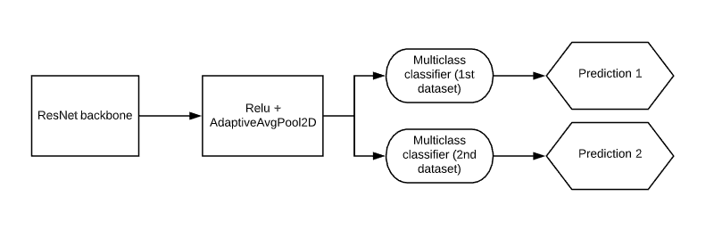

# multitask-classification

We train 2 DNN classifiers on 2 different datasets and a single multitask classifier and examine their performance.

* Base model: Resnet20.
* Dataset 1: Fashion MNIST
* Dataset 2: Imagewoof
* Metrics: top-1 accuracy, Confusion Matrix

